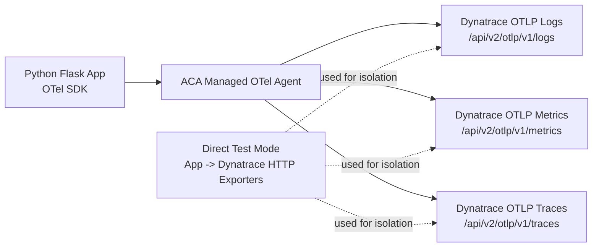

# Azure Container Apps + OpenTelemetry + Dynatrace Sample

This sample shows how to send OpenTelemetry telemetry from a Python app in Azure Container Apps (ACA) to Dynatrace.

## Dynatrace Environment Links

- Environment home: https://lwh98919.live.dynatrace.com
- OTLP base endpoint: https://lwh98919.live.dynatrace.com/api/v2/otlp
- OTLP logs endpoint: https://lwh98919.live.dynatrace.com/api/v2/otlp/v1/logs
- OTLP metrics endpoint: https://lwh98919.live.dynatrace.com/api/v2/otlp/v1/metrics
- OTLP traces endpoint: https://lwh98919.live.dynatrace.com/api/v2/otlp/v1/traces

Use the Dynatrace environment home link above to open Logs and Distributed Traces in the UI for validation.

## Architecture Diagram

## Current Issue (Important)

Current validation status:

- Direct app-to-Dynatrace mode: validated for logs, metrics, and traces.
- Managed ACA forwarding mode: app emits telemetry, but the same marker is not visible in Dynatrace.

Conclusion so far: app instrumentation and Dynatrace ingestion are working; issue appears isolated to managed ACA forwarding in this environment.

## Token Safety and Redaction

This repository does not contain real API tokens.

- Never commit real Dynatrace tokens.
- Use placeholders like `<DYNATRACE_INGEST_TOKEN>` in commands.
- Rotate/revoke any token that was ever exposed.

### How to Obtain a Dynatrace Ingest Token

1. In Dynatrace, go to Access tokens.
2. Create a token for OTLP ingest.
3. Minimum scopes for this sample:
   - `logs.ingest`
   - `metrics.ingest`
   - `openTelemetryTrace.ingest`
4. Copy the token once and store it securely (for example, Key Vault or your local secret store).

## Documentation

- Tutorial: [docs/tutorial.md](docs/tutorial.md)
- Architecture: [docs/architecture.md](docs/architecture.md)

## Repository Structure

- `app/` Python Flask app instrumented with OpenTelemetry SDK
- `infra/` Bicep templates for ACA environment and OTLP destinations
- `docs/` Tutorial and architecture notes

## Sharing with Engineering

When sharing this sample, include:

- Managed-mode marker used in testing (for example `ACA_MANAGED_CONFIRM_20260514`)
- Evidence that direct mode succeeds for all three signals
- Evidence that managed mode emits app logs but data does not appear in Dynatrace

This gives engineering a reproducible isolation of the forwarding gap.
