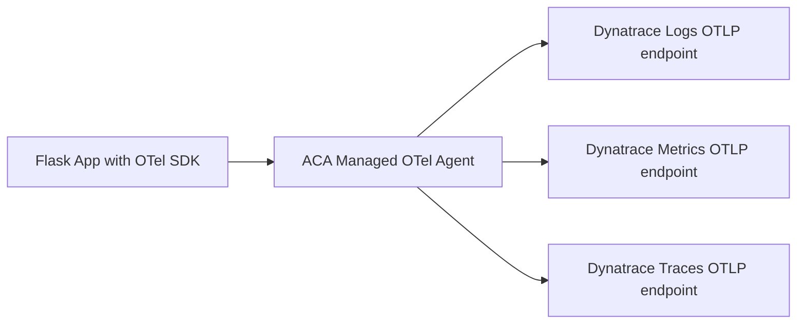

# Architecture

## Overview

This sample supports two telemetry paths:

- Managed path (target architecture): App -> ACA managed OTel agent -> Dynatrace OTLP endpoints
- Direct path (diagnostic mode): App -> Dynatrace OTLP endpoints

The direct path was used to isolate issues and prove app instrumentation plus Dynatrace ingestion are healthy.

Dynatrace environment for this sample: https://lwh98919.live.dynatrace.com

## Diagram

Direct path (diagnostic mode) is intentionally not shown in the diagram to keep the architecture view focused on the target managed flow.

## Managed OTLP destinations

Configured per signal in ACA environment telemetry:

- Logs endpoint: `/api/v2/otlp/v1/logs`
- Metrics endpoint: `/api/v2/otlp/v1/metrics`
- Traces endpoint: `/api/v2/otlp/v1/traces`

Full endpoint links:

- https://lwh98919.live.dynatrace.com/api/v2/otlp/v1/logs
- https://lwh98919.live.dynatrace.com/api/v2/otlp/v1/metrics
- https://lwh98919.live.dynatrace.com/api/v2/otlp/v1/traces

## Current behavior summary

- Direct path: logs, metrics, traces validated in Dynatrace.
- Managed path: app emits telemetry, but marker does not appear in Dynatrace.
- Working theory: managed forwarding path regression or platform issue in current preview behavior.
